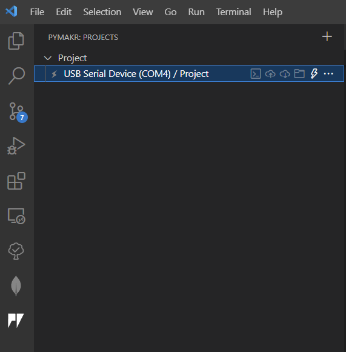
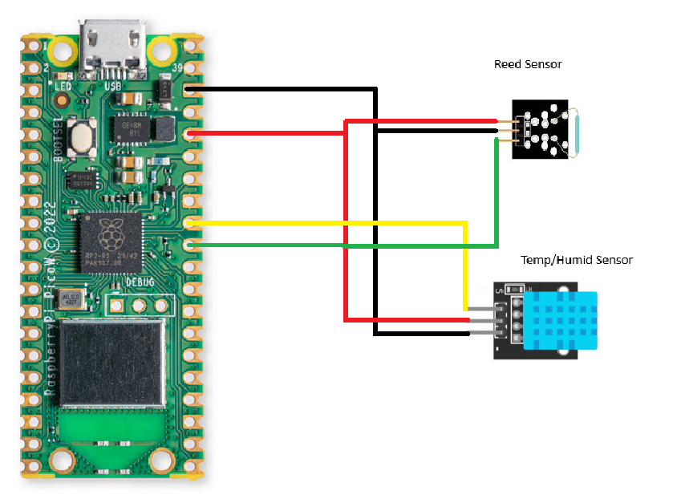
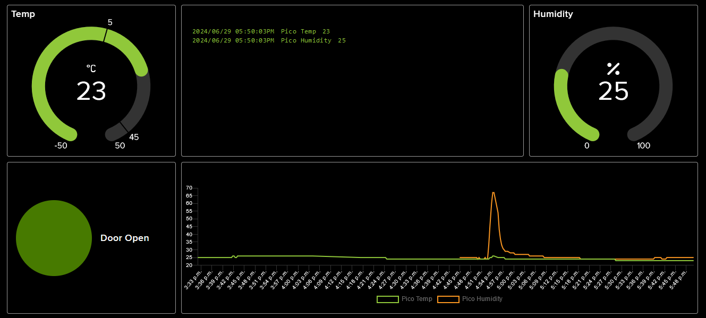
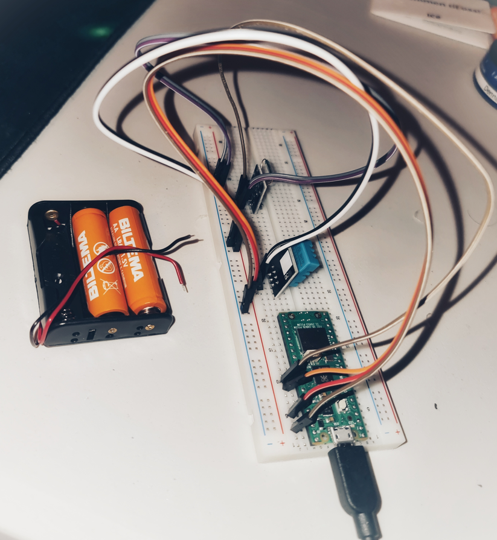

# Pico Cabin Monitor
---

Henrik Oskarsson - ho222pk

---
### Overview

The aim of this project is to create a monitor for a Cabin by tracking temperature, humidity and entry (door sensor) using a Raspberry Pi Pico that then interfaces with Adafruit to visualize the data, and even provide warnings if the temperature drops to low.

The estimated time to setup this device following the instructions outlined here should be approximately a day. 

### Objective

The reason for this projects existence is that my father owns a cottage that uses electrically powered water heating. A power failure, or a fuse tripping, might result in the temperature dropping below zero in winter time,  with the freezing of the water piping as a consequence. 

Monitoring the temperature over time will also provide good insight for selecting a good temperature setting for the maintenance heating.


---
## Materials

The following materials were used.
Link to elektrokit: https://www.electrokit.com/

| Hardware                                       | Description                          | Price inc. VAT (SEK) |
| ---------------------------------------------- | ------------------------------------ | -------------------- |
| Raspberry Pi Pico WH                           | Microcontroller that reads sensors.  | 109                  |
| Breadboard 840 connections                     | Mainly used to simplify connections. | 69                   |
| **Sensors & Components**                       |                                      |                      |
| DHT-11 Digital Temperature and Humidity Sensor | Sensor for humidity and temperature  | 49                   |
| Lab wire male/male kit                         | Interconnect                         | 29                   |
| Micro USB cable                                | System power                         | 19                   |
| Reed Sensor                                    | Front door monitoring                | 25                   |

---

### Computer Setup

To program the Pico, a Windows machine was used running Visual Studio Code with the Pymakr extension. Before any coding begins, it is a good idea to update the firmware with the latest micropython. By holding the BOOTSEL button when connecting the device to the computer, it will show up as a folder similar to a normal USB drive. The firmware can then be [downloaded](https://micropython.org/download/RPI_PICO_W/) and dropped just dropped to the Pico that automatically will install the firmware. 

Programming can now commence by making a new project in Pymakr.



First click the Pymakr icon (bottom left), and select *New Project*.  After selecting a folder you will get the option to select a COM port, in my case I could select 1,3 or 4. If you are uncertain, you can try this procedure with and without the Pico connected and the correct COM port will be apparent. In the screenshot, the Pico is added successfully, and the lightning symbol can be clicked to connect to the device, which will then look like this:

!

To upload files from you project folder, the arrow into the cloud can be clicked and after a second or two the files will be loaded on the device. The Pico will normally look for two python files, *boot.py* and *main.py*. The first one will run directly after booting followed by the *main.py*. In my case, only a main file was used. Instead of rebooting the device to run the code, I clicked the terminal icon and entered `exec(open('main.py').read())`. Execution is easily stopped using the universal Ctrl+C command.

---
### The Wiring

GPIO26 is connected to the Reed Sensor that can sense the presence of a magnetic field and thus be used to detect if a door is open when paired with a magnet.

GPIO27 is connected to the DHT 11 Sensor to read temperature and humidity.




--- 
### Visualization of data

To gather and visualize data, Adafruit was selected since it is easy to setup with a free account. In the future, when my Raspberry Pi 4 arrives, it will run the TIG stack for both privacy and update frequency (limited on Adafruit free tier) reasons.

Adafruit provides an easy way to setup different feeds and a dashboard for visualzing the data. A separate feed is used for each sensor value. After selecting visualization blocks, the dashboard looks like this.
 

---

### The Code

Pycom's micropython library for MQTT is used to facilitate MQTT communication. The *MQTTClient* class is defined in `mqtt.py`. The `wifiConnection.py` file handles the setup of the WiFi connection. Finally, `keys.py` stores the Adafruit API-key, WiFi credentials, ip-address and the Adafruit feed paths. Make sure this file is not shared to github, like I accidentally did which immediately broke down my Adafruit connection. Interestingly enough, Adafruit was notified that one of their API-keys were pushed to a public repo, and immediately killed the API-key. 

The remaining code is all contained in `main.py`.

Lets inspect the `send_reed()` function that is responsible for sending Reed Sensor values.

```python
reed_switch = machine.Pin(26, machine.Pin.IN)
REED_INTERVAL = 5000
last_reed_sent = 0  # milliseconds

def send_reed():
    global last_reed_sent
    global REED_INTERVAL
    
    if ((time.ticks_ms() - last_reed_sent) < REED_INTERVAL):
        return; # Too soon since last one sent.
        
    try:
        reed_value = reed_switch.value()
        print("Publishing: {0} to {1} ... ".format(reed_value, keys.AIO_REED_FEED), end='')
        client.publish(topic=keys.AIO_REED_FEED, msg=str(reed_value))
        print("DONE")

    except Exception as e:
        print("FAILED")
    finally:
        last_reed_sent = time.ticks_ms()
```

The *machine* library is done to setup GPIO pin 26 as an input. The input can be read at any time for a discrete value (digital signal) which will indicate either 1 (magnet present) or 0. The interval is set to 5 seconds since a door is usually open at least that amount of time when entering the building. If less than five seconds has passed since a value was last published, the function will just return, otherwise it will publish the current value to `m1tron/feeds/reed` on Adafruit. Some printing is also done that can be helpful while monitoring the console output of the device.

After defining *send_reed()* and *send_temp_humid()*, the WiFi and MQTTClient is initialized.

```python
# Try WiFi Connection
try:
    ip = wifiConnection.connect()
except KeyboardInterrupt:
    print("Keyboard interrupt")

# Use the MQTT protocol to connect to Adafruit IO
client = MQTTClient(keys.AIO_CLIENT_ID, keys.AIO_SERVER, keys.AIO_PORT, keys.AIO_USER, keys.AIO_KEY)
client.connect()
```

Finally, the main loop is entered.

```python
while 1:          # Repeat forever
    send_temp_humid()
    send_reed()
    time.sleep(2)
```

---

### Connectivity options

The wireless protocol chosen in this project was WiFi. The contenders were LTE and LoRa. Let's break down the pros and cons.
- WiFi
	-  Availability: Already have access to WiFi, with redundancy using the nearest neighbors WiFi
	-  Cost: Free
-  LTE
	- Availability: Barely, but feasible for this usecase
	-  Cost: Monthly plan
-  LoRa
	- Availability: No coverage, would need to setup own base station
	- Cost: Prohibitive due to above reason

Due to the availability of WiFi at no cost, and since range is not an issue, it was an easy choice for this project.

The MQTT protocol was used since Adafruit is used to visualize the data, while also being an MQTT broker. No webhook was created for this project, but Adafruit provides this functionality if it would become interesting to create a discord bot in the future.

---

### Final Design

The final product in all its glory.



Since this device will be placed in the attic, it might remain in its breadboard form. However, a simple cardboard box or other enclosure will probably be used to protect it from dust. The device can also run on batteries, but I am still missing a Schottky diode before both power sources can be connected at the same time (to prevent back feed). This will enable power redundancy, letting the system continuing to deliver updates even during a power outage. A free GPIO pin could even be used to monitor the VBUS pin to detect when this happens and publish this information.